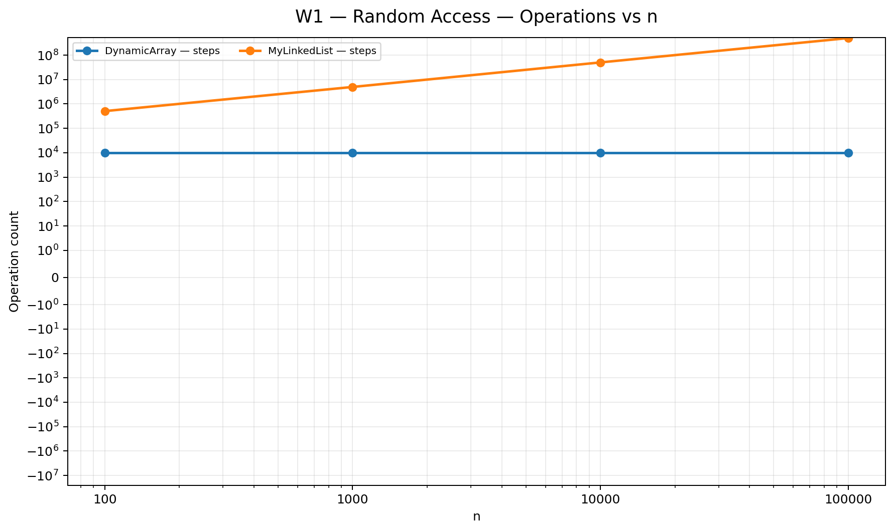
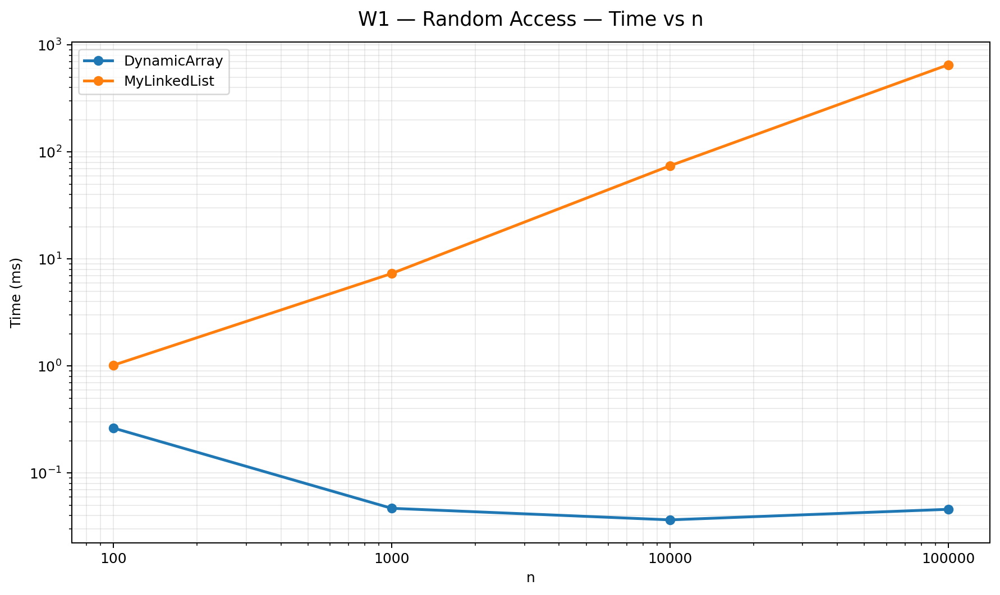
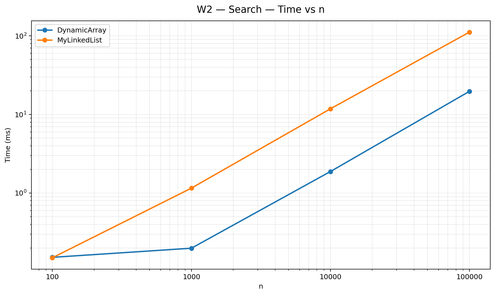
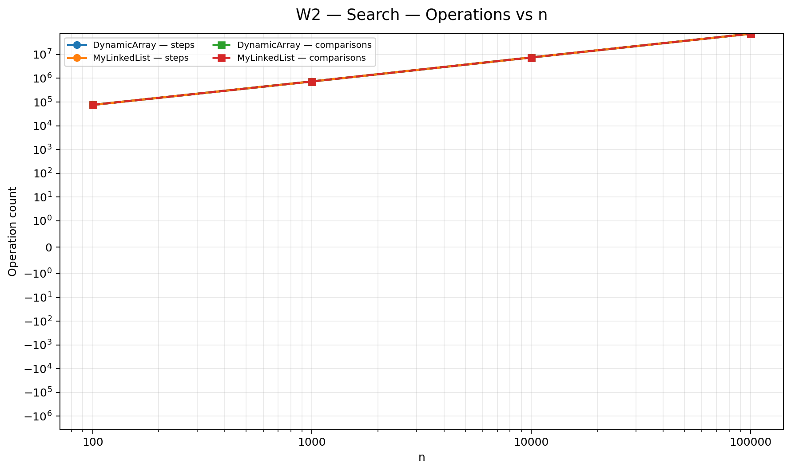
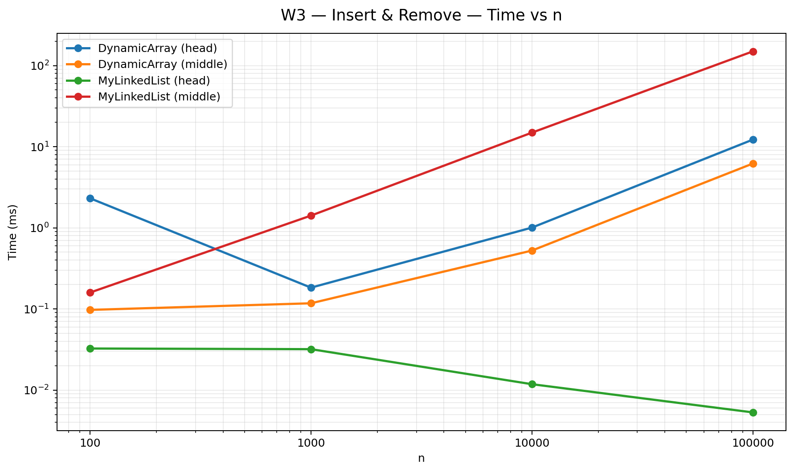
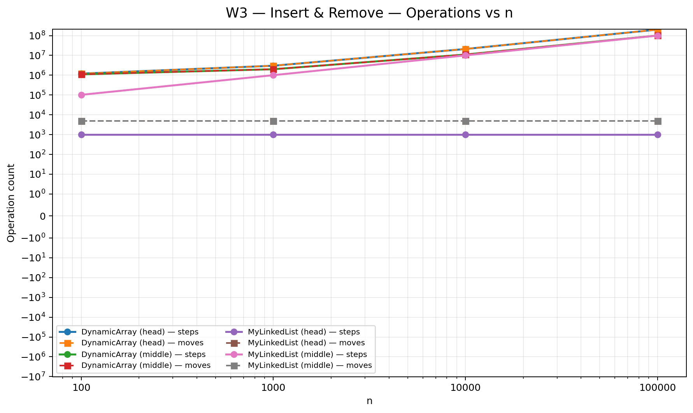
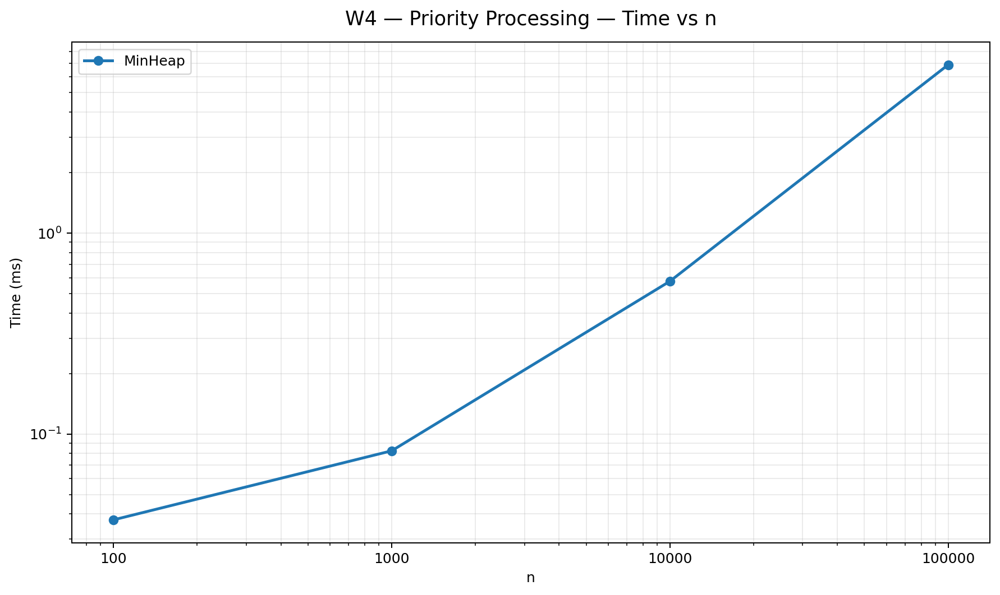
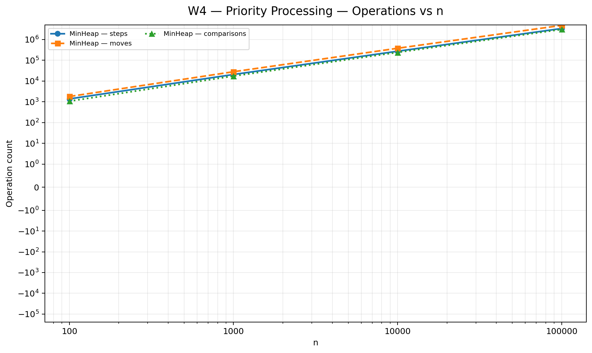

# REPORT_updated

# Assignment 2 Report - Data Structures

## 1. Asymptotic Complexity Table

| Structure | Operation | Best Case | Average Case | Worst Case | Space | Justification |
| --- | --- | --- | --- | --- | --- | --- |
| **DynamicArray** | `get(i)` | $\Theta(1)$ | $\Theta(1)$ | $\Theta(1)$ | $O(n)$ | Direct index-based array offset access. |
| **DynamicArray** | `add(x)` | $\Theta(1)$ | $\Theta(1)$ | $\Theta(n)$ | $O(n)$ | Amortized $\Theta(1)$; worst case $\Theta(n)$ occurs during array 2x expansion. |
| **DynamicArray** | `add(i, x)` | $\Theta(1)$ | $\Theta(n)$ | $\Theta(n)$ | $O(n)$ | Requires shifting elements to the right. Best case at `i = size`. |
| **DynamicArray** | `remove(i)` | $\Theta(1)$ | $\Theta(n)$ | $\Theta(n)$ | $O(n)$ | Requires shifting elements to the left. Best case at `i = size - 1`. |
| **DynamicArray** | `contains(x)` | $\Theta(1)$ | $\Theta(n)$ | $\Theta(n)$ | $O(n)$ | Linear search through continuous array memory. |
| **MyLinkedList** | `get(i)` | $\Theta(1)$ | $\Theta(n)$ | $\Theta(n)$ | $O(n)$ | Sequential pointer traversal from head to index `i`. |
| **MyLinkedList** | `add(x)` | $\Theta(1)$ | $\Theta(1)$ | $\Theta(1)$ | $O(n)$ | Direct pointer modification at `tail`. |
| **MyLinkedList** | `add(i, x)` | $\Theta(1)$ | $\Theta(n)$ | $\Theta(n)$ | $O(n)$ | Traversing to index takes $O(n)$, inserting node takes $O(1)$. |
| **MyLinkedList** | `remove(i)` | $\Theta(1)$ | $\Theta(n)$ | $\Theta(n)$ | $O(n)$ | Traversing to index takes $O(n)$, unlinking node takes $O(1)$. |
| **MyLinkedList** | `contains(x)` | $\Theta(1)$ | $\Theta(n)$ | $\Theta(n)$ | $O(n)$ | Sequential search by dereferencing node pointers. |
| **MinHeap** | `insert(x)` | $\Theta(1)$ | $O(\log n)$ | $O(\log n)$ | $O(n)$ | Appends at end, bubbles up tree height ($\log n$). |
| **MinHeap** | `peekMin()` | $\Theta(1)$ | $\Theta(1)$ | $\Theta(1)$ | $O(n)$ | Root element access at array index 0. |
| **MinHeap** | `extractMin()` | $\Theta(1)$ | $O(\log n)$ | $O(\log n)$ | $O(n)$ | Replaces root with last element and bubbles down tree height ($\log n$). |

---

## 2. Loop Invariant Proofs

### Proof 1: `contains(x)` in `DynamicArray`

- **Loop Invariant:** At the start of iteration $i$ (where $0 \le i \le \text{size}$), the target value $x$ is not present in the subarray `data[0 ... i - 1]`.
- **Initialization:** Before the first iteration ($i = 0$), the subarray `data[0 ... -1]` is empty. Therefore, $x$ is trivially not present in the empty subarray, so the invariant holds.
- **Maintenance:** Assume the invariant holds before iteration $i$. During iteration $i$, the element `data[i]` is compared with $x$:
    - If `data[i] == x`, the loop terminates immediately and returns `true`, which is correct.
    - If `data[i] != x`, the loop proceeds to iteration $i + 1$. Since $x \notin \text{data}[0 \dots i-1]$ and $\text{data}[i] \neq x$, $x$ is not present in `data[0 ... i]`. The invariant holds for $i + 1$.
- **Termination:** The loop stops when $i = \text{size}$. By the invariant, $x$ is not in `data[0 ... size - 1]`. The function returns `false`.
- **Conclusion:** This proves that `contains(x)` correctly returns `true` if and only if $x$ is inside the `DynamicArray`.

### Proof 2: `bubbleDown(index)` in `MinHeap`

- **Loop Invariant:** At the beginning of each iteration, every node in the binary heap tree satisfies the Min-Heap property ($\text{parent} \le \text{children}$), except possibly the node at `index` relative to its direct children.
- **Initialization:** Before the loop starts (after replacing the root with the last element), the subtrees under the left and right children of root are valid Min-Heaps. Only the new root (`index = 0`) might violate the property. The invariant holds.
- **Maintenance:** During the iteration, if `data[index]` is greater than its smallest child, `swap(index, smallest)` is performed. This restores the Min-Heap property for the parent node and pushes the potential violation down to the child index `smallest`. Setting `index = smallest` maintains the invariant for the next iteration.
- **Termination:** The loop terminates when `index` has no children or `data[index] <= data[smallest]`. At this point, no violations remain in the tree.
- **Conclusion:** Upon termination, every node in the heap satisfies the Min-Heap condition, proving that `bubbleDown` correctly restores heap structure.

---

## 3. Plots

### W1 - Random Access

` | $\Theta(1)$ | $\Theta(1)$ | $\Theta(1)$ | $O(n)$ | Direct index-based array offset access. |
| **DynamicArray** | `add(x)` | $\Theta(1)$ | $\Theta(1)$ | $\Theta(n)$ | $O(n)$ | Amortized $\Theta(1)$; worst case $\Theta(n)$ occurs during array 2x expansion. |
| **DynamicArray** | `add(i, x)` | $\Theta(1)$ | $\Theta(n)$ | $\Theta(n)$ | $O(n)$ | Requires shifting elements to the right. Best case at `i = size`. |
| **DynamicArray** | `remove(i)` | $\Theta(1)$ | $\Theta(n)$ | $\Theta(n)$ | $O(n)$ | Requires shifting elements to the left. Best case at `i = size - 1`. |
| **DynamicArray** | `contains(x)` | $\Theta(1)$ | $\Theta(n)$ | $\Theta(n)$ | $O(n)$ | Linear search through continuous array memory. |
| **MyLinkedList** | `get(i)` | $\Theta(1)$ | $\Theta(n)$ | $\Theta(n)$ | $O(n)$ | Sequential pointer traversal from head to index `i`. |
| **MyLinkedList** | `add(x)` | $\Theta(1)$ | $\Theta(1)$ | $\Theta(1)$ | $O(n)$ | Direct pointer modification at `tail`. |
| **MyLinkedList** | `add(i, x)` | $\Theta(1)$ | $\Theta(n)$ | $\Theta(n)$ | $O(n)$ | Traversing to index takes $O(n)$, inserting node takes $O(1)$. |
| **MyLinkedList** | `remove(i)` | $\Theta(1)$ | $\Theta(n)$ | $\Theta(n)$ | $O(n)$ | Traversing to index takes $O(n)$, unlinking node takes $O(1)$. |
| **MyLinkedList** | `contains(x)` | $\Theta(1)$ | $\Theta(n)$ | $\Theta(n)$ | $O(n)$ | Sequential search by dereferencing node pointers. |
| **MinHeap** | `insert(x)` | $\Theta(1)$ | $O(\log n)$ | $O(\log n)$ | $O(n)$ | Appends at end, bubbles up tree height ($\log n$). |
| **MinHeap** | `peekMin()` | $\Theta(1)$ | $\Theta(1)$ | $\Theta(1)$ | $O(n)$ | Root element access at array index 0. |
| **MinHeap** | `extractMin()` | $\Theta(1)$ | $O(\log n)$ | $O(\log n)$ | $O(n)$ | Replaces root with last element and bubbles down tree height ($\log n$). |

---

## 2. Loop Invariant Proofs

### Proof 1: `contains(x)` in `DynamicArray`

- **Loop Invariant:** At the start of iteration $i$ (where $0 \le i \le \text{size}$), the target value $x$ is not present in the subarray `data[0 ... i - 1]`.
- **Initialization:** Before the first iteration ($i = 0$), the subarray `data[0 ... -1]` is empty. Therefore, $x$ is trivially not present in the empty subarray, so the invariant holds.
- **Maintenance:** Assume the invariant holds before iteration $i$. During iteration $i$, the element `data[i]` is compared with $x$:
    - If `data[i] == x`, the loop terminates immediately and returns `true`, which is correct.
    - If `data[i] != x`, the loop proceeds to iteration $i + 1$. Since $x \notin \text{data}[0 \dots i-1]$ and $\text{data}[i] \neq x$, $x$ is not present in `data[0 ... i]`. The invariant holds for $i + 1$.
- **Termination:** The loop stops when $i = \text{size}$. By the invariant, $x$ is not in `data[0 ... size - 1]`. The function returns `false`.
- **Conclusion:** This proves that `contains(x)` correctly returns `true` if and only if $x$ is inside the `DynamicArray`.

### Proof 2: `bubbleDown(index)` in `MinHeap`

- **Loop Invariant:** At the beginning of each iteration, every node in the binary heap tree satisfies the Min-Heap property ($\text{parent} \le \text{children}$), except possibly the node at `index` relative to its direct children.
- **Initialization:** Before the loop starts (after replacing the root with the last element), the subtrees under the left and right children of root are valid Min-Heaps. Only the new root (`index = 0`) might violate the property. The invariant holds.
- **Maintenance:** During the iteration, if `data[index]` is greater than its smallest child, `swap(index, smallest)` is performed. This restores the Min-Heap property for the parent node and pushes the potential violation down to the child index `smallest`. Setting `index = smallest` maintains the invariant for the next iteration.
- **Termination:** The loop terminates when `index` has no children or `data[index] <= data[smallest]`. At this point, no violations remain in the tree.
- **Conclusion:** Upon termination, every node in the heap satisfies the Min-Heap condition, proving that `bubbleDown` correctly restores heap structure.

---

## 3. Plots

### W1 - Random Access

### W2 - Search

### W3 - Insert & Remove

### W4 - Priority Processing

---

## 4. Performance Discussion

1. **CPU Cache Locality & Spatial Locality:** `DynamicArray` performs significantly faster than `MyLinkedList` for sequential iteration and index-based access (`get`). Arrays store elements in contiguous physical memory, allowing CPU L1/L2 cache pre-fetching (spatial locality) to load entire cache lines (64 bytes) at once.
2. **Pointer Chasing & GC Overhead:** `MyLinkedList` nodes are separate Java objects scattered across heap memory. Traversing the list requires “pointer chasing”, causing frequent CPU cache misses. Moreover, creating Node objects adds memory headers (12–16 bytes per object) and places additional pressure on the Garbage Collector.
3. **Optimal Data Structure Selection:**
    - **`DynamicArray`** is best for general-purpose access, fast random reads, and appending elements.
    - **`MyLinkedList`** is advantageous only when frequent insertions and removals occur strictly at the boundaries (head/tail) without index searching.
    - **`MinHeap`** is the ideal choice for priority queues, where finding and extracting the minimum element must be fast ($O(1)$ read, $O(\log n)$ extraction).

[https://github.com/TwoThousand07/DAA_Assignment2/tree/main](https://github.com/TwoThousand07/DAA_Assignment2/tree/main)_n.png)

### W2 - Search

### W3 - Insert & Remove

### W4 - Priority Processing

---

## 4. Performance Discussion

1. **CPU Cache Locality & Spatial Locality:** `DynamicArray` performs significantly faster than `MyLinkedList` for sequential iteration and index-based access (`get`). Arrays store elements in contiguous physical memory, allowing CPU L1/L2 cache pre-fetching (spatial locality) to load entire cache lines (64 bytes) at once.
2. **Pointer Chasing & GC Overhead:** `MyLinkedList` nodes are separate Java objects scattered across heap memory. Traversing the list requires “pointer chasing”, causing frequent CPU cache misses. Moreover, creating Node objects adds memory headers (12–16 bytes per object) and places additional pressure on the Garbage Collector.
3. **Optimal Data Structure Selection:**
    - **`DynamicArray`** is best for general-purpose access, fast random reads, and appending elements.
    - **`MyLinkedList`** is advantageous only when frequent insertions and removals occur strictly at the boundaries (head/tail) without index searching.
    - **`MinHeap`** is the ideal choice for priority queues, where finding and extracting the minimum element must be fast ($O(1)$ read, $O(\log n)$ extraction).

[https://github.com/TwoThousand07/DAA_Assignment2/tree/main](https://github.com/TwoThousand07/DAA_Assignment2/tree/main)